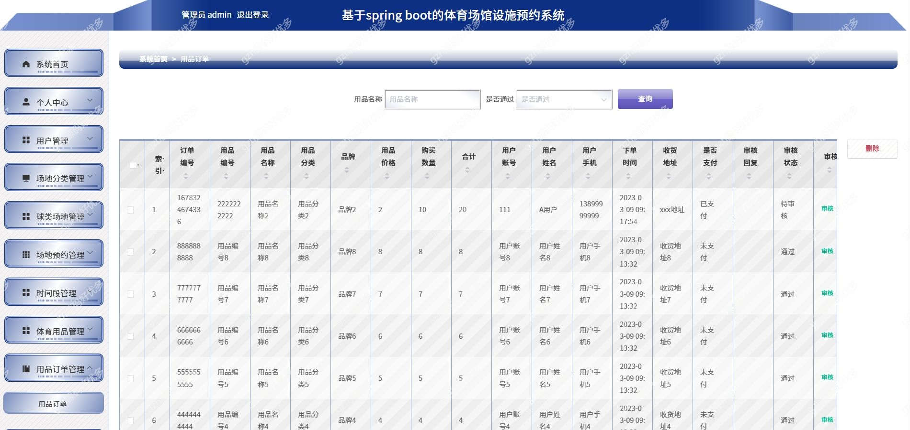
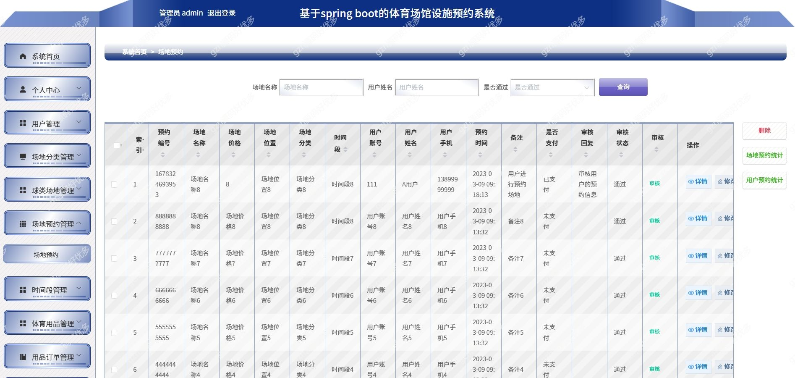
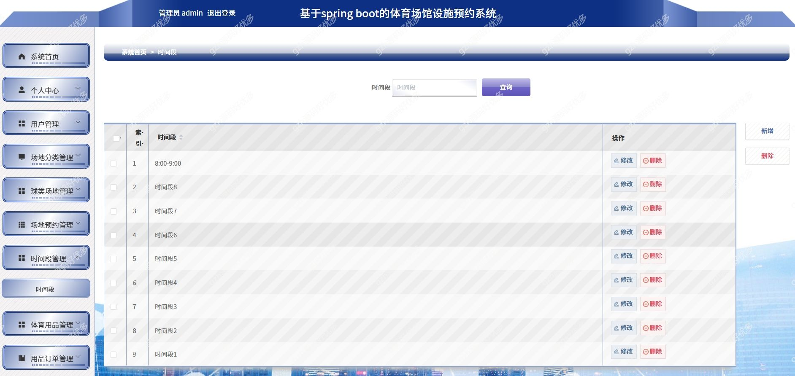
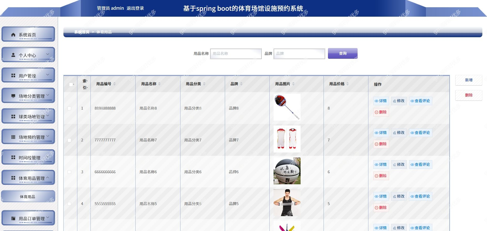

# springbootA331
springbootA331体育场馆设施预约系统
 
## 查看主页获取源码

### 一、关键词
体育场馆设施预约系统，体育场馆系统

### 二、作品包含
源码+数据库+万字设计文档+PPT+全套环境和工具资源+本地部署教程

### 三、项目技术
前端技术：Html、Css、Js、Vue2.0、Element-ui 
后端技术：Java、SpringBoot2.0、MyBatis

### 四、运行环境（以下版本亲测，其他版本兼容性请自行测试）
开发工具：IDEA/eclipse  + VSCODE
数据库：MySQL5.7

数据库管理工具：Navicat10以上版本

环境配置软件： JDK1.8 + Maven3.6.3

前端Nodejs：14

浏览器：谷歌浏览器

### 五、项目介绍
项目编号：springbootA331

体育场馆设施预约系统主要通过计算机网络，对体育场馆设施预约系统的信息进行统一管理，方便管理员随时随地进行增添、修改、查询、删除各类信息，也方便用户查询球类场地、体育用品、场地通知、球馆留言等。本系统极大的促进了系统与数据库管理系统软件之间的配合，满足了绝大部分用户的需求，给用户带来了很大的便利

### 六、运行截图

